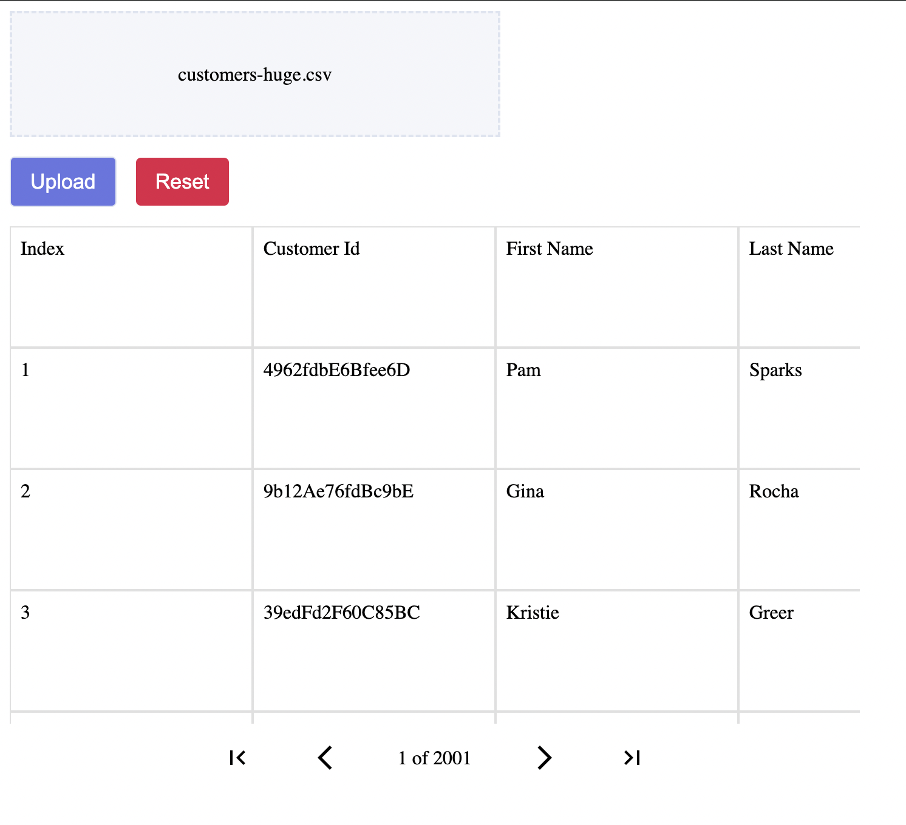
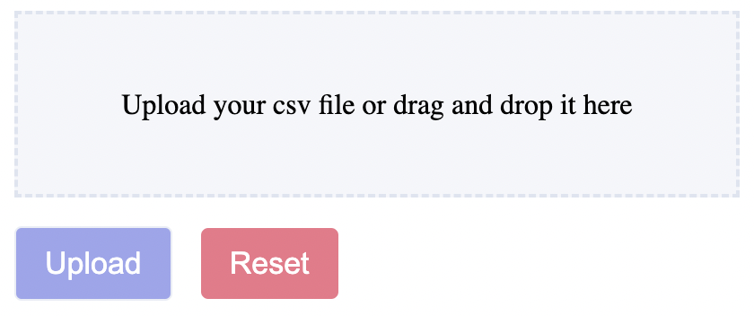
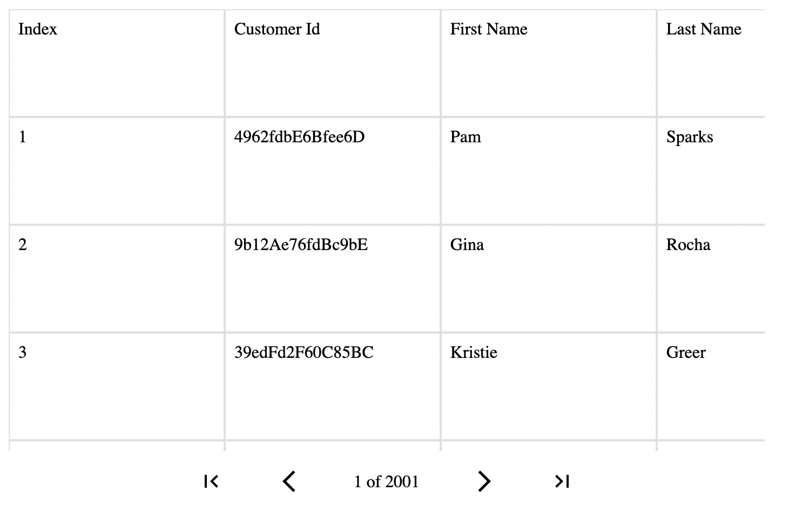

# React CSV Upload

A simple React library to upload CSV files to a remote cloud file storage. You can view the parsed CSV file using the `<DisplayGrid />` component and to access the data using a publicly available endpoint after the file has been successful uploaded to the database.

## Installation

Use the package manager [npm](https://www.npmjs.com/) to install the library.

```bash
npm i @yash_sc1ence/react-csv-upload
```

## Usage

```typescript
import {
  UploadProvider,
  Uploader,
  DisplayGrid,
} from "@yash_sc1ence/react-csv-upload";

function CsvUploadSection() {
  return (
    <>
      <UploadProvider access_key={your_access_key}>
        <div className="upload-section-container">
          <Uploader />
          <DisplayGrid
            width={700}
            height={450}
            rowHeight={100}
            columnHeight={200}
          />
        </div>
      </UploadProvider>
    </>
  );
}

export default CsvUploadSection;
```



## Components

-   Upload Provider: `<UploadProvider />`

    In order for any of these components to work as expected they need to be decendants of the `<UploadProvider />` component.
    This is the place where you will specify your `access_key`.
    Please refer to the [csv-uploader-api](https://github.com/yassh-pandey/csv-uploader-api) repo to know more about how to generate an `access_key` for your project.

    ```typescript
    interface UploadProviderProps {
        children: ReactNode;
        access_key: string;
    }
    ```

-   Uploader: `<Uploader />`

    The main section which you'll use to select the CSV files to be uplaoded from your local file storage. You can either click on this region or drag and drop files over it to begin the parsing process.

    ```typescript
    interface UploaderProps {
        // Width of the DND (drag and drop) region
        width?: number;
        // Height of the DND (drag and drop) region
        height?: number;
        // Placeholder text for the DND region
        placeholder?: string;
        // If false, will not show the upload file progress.
        // True by default.
        showUploadProgress?: boolean;
        // If false, will not show the parsing file progress.
        // True by default.
        showParsingProgress?: boolean;
        // Chunck size to be considered by the parsing library.
        // 10 MBs by default.
        parsingChunkSize?: number;
        // Maximum allowed size for file upload.
        // 1 GBs by default.
        maxFileSize?: number;
        // Async callback to be called after file upload success.
        handleUploadSuccess?: () => Promise<void>;
        // If set false then will not show toast notifications for success or failure.
        // True by default.
        showToastNotifications?: boolean;
        // Display a reset button to reset after successful upload or a failure.
        // True by default.
        showReset?: boolean;
    }
    ```

    

-   Display Grid: `<DisplayGrid />`

    Used to display the CSV file once it's parsed using the [papaparse](https://www.npmjs.com/package/papaparse) library in a separate worker thread.

    ```typescript
    interface DisplayGridProps {
        // Sets the width of the display grid in pixels
        width?: number;

        // Sets the height of the display grid in pixels
        height?: number;

        // Sets the height of individual cell of the grid in pixels
        rowHeight: number;

        // Sets the width of individual cell of the grid in pixels
        columnHeight: number;

        // No of items you want to see in grid at once. Defaults to 1000
        pageSize?: number;

        // If set false then you do not see any toast bars on
        // operation completion or errors
        showToastNotifications?: boolean;
    }
    ```

    

-   Progress: `<Progress />`

    Used to display the progress of Uploading file or progress of file being parsed. It is already included in `<Uplaoder />` component by default but you can control that behaviour and use it separately for other use cases.

    ```typescript
    interface PlayControls {
        // Whether to show play button in progress bar
        play: boolean;
        // Whether to show pause button in progress bar
        pause: boolean;
        // Whether to abort button in progress bar
        abort: boolean;
        // Whether to processing button in progress bar
        finalProcessing: boolean;
    }

    interface ParsingProgressProps {
        // Width of the progress bar (including any play control buttons) in pixels
        width?: number;
        // Height of the progress bar in pixels
        height?: number;
        // Background Color of the progress bar, the progress will happen over this color
        backgroundColor?: string;
        // The actual progress color
        progressColor?: string;
        // Play controls to be displayed along with the progress bar
        playControls?: Partial<PlayControls>;
        // Play click callback
        handlePlayClick?: () => void;
        // Pause click callback
        handlePauseClick?: () => void;
        // Abort click callback
        handleAbortClick?: () => void;
        // Percentage depicting the progress (50 means 50% completed)
        percentage: number;
    }
    ```

    

## Contributing

Pull requests are welcome. For major changes, please open an issue first
to discuss what you would like to change.

Please make sure to update tests as appropriate.

## License

React CSV Upload is [fair-code](https://faircode.io/) distributed under distributed under [Apache 2.0](https://www.apache.org/licenses/LICENSE-2.0.txt) with [Commons Clause](https://commonsclause.com/) license.

[Please click here to check the complete license.](LICENSE.md)
